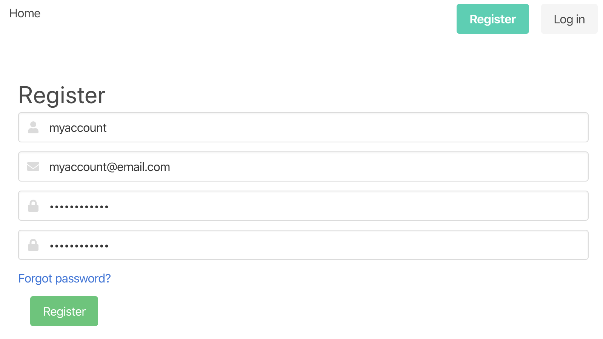
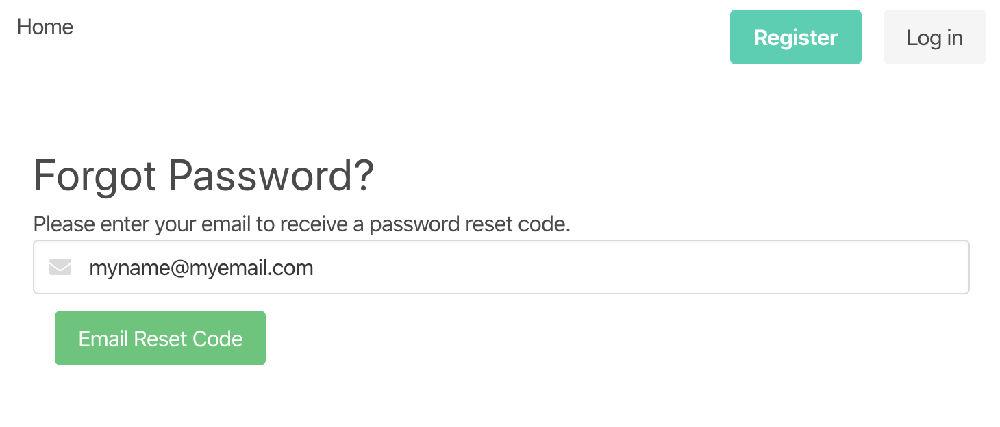
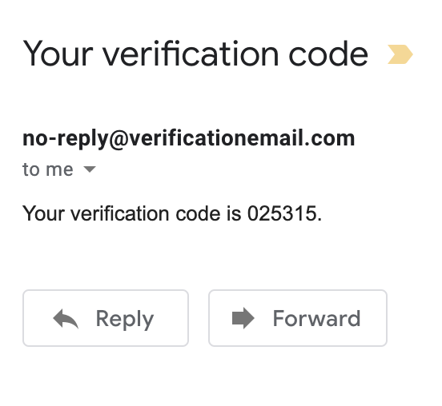
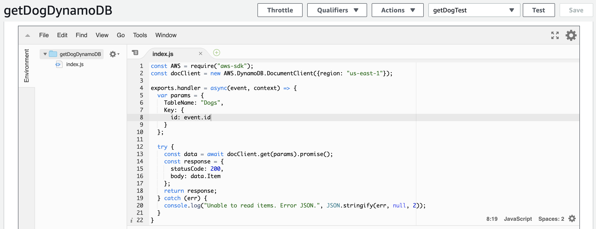
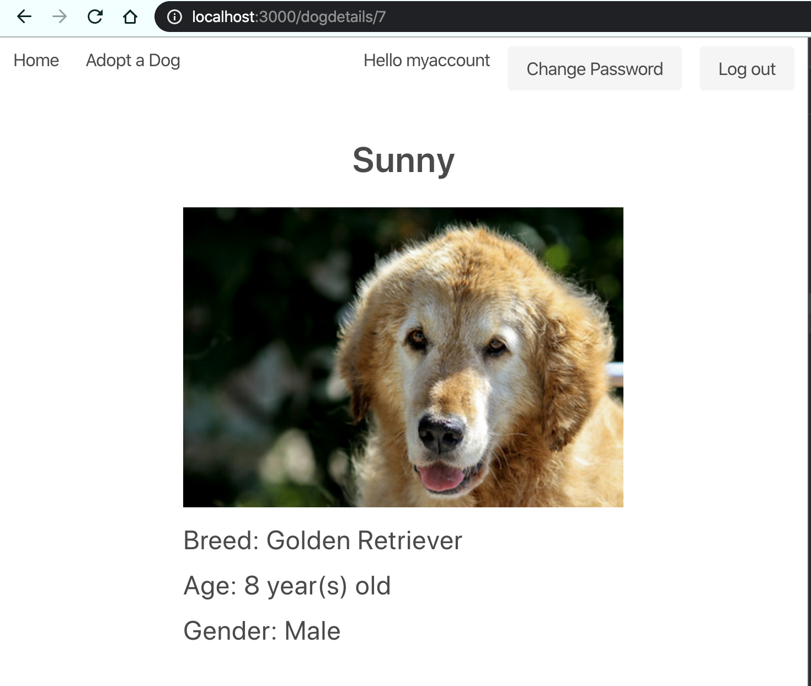
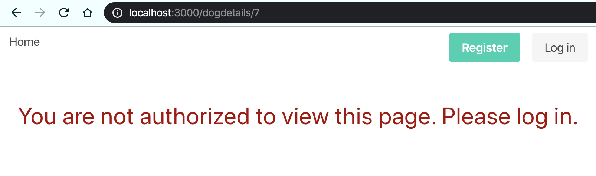

# AWS React Dog Application

This application was developed with the React framework and implements several AWS features. Amazon Cognito was implemented to facilitate user sign up, sign in, and access control. Users can register and login to view a page of dogs available for adoption. Only logged in users are allowed access to these pages, with authorization facilitated by Cognito and persisting until the user logs out.

The data for the listing of dogs is contained in an AWS DynamoDB table, and S3 bucket for the images. Lambda functions were implemented and connected to an API Gateway to make calls within the application in order to retrieve the data for the dog listing.

## AWS Implementation Samples

### Cognito Sign-up
Users can register through a form through the website which is integrated with Cognito.

They will then receive a verificaton email to verify their registration with their email address.

The conventional account functionalities are also implememnted with Cognito, such as allowing users to reset their password.

When users submit the form, they will receive a verificaton code from the Cognito service to reset their password.

### API and Lambda

Below is an example of a Lambda function that is used to get a single instance of a dog from the DynamoDB database table. The lambda takes an id parameter to obtain the appropriate instance from the 'Dogs' table.

In the React client, the API call is made to a GET method in the API Gateway which triggers the Lambda function above, and retrieves the appropriate dog data.

If the user is not logged in, they will not be authorized to view the page and will instead see the screen below.

